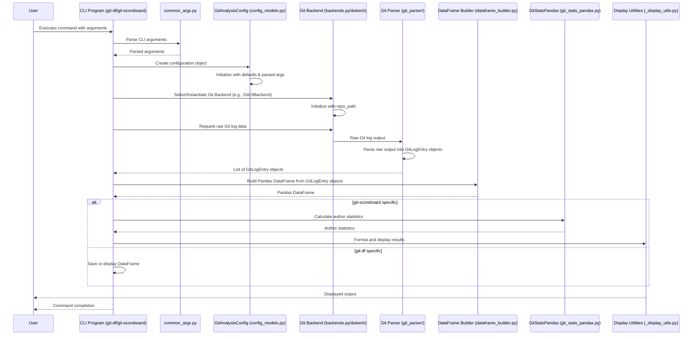
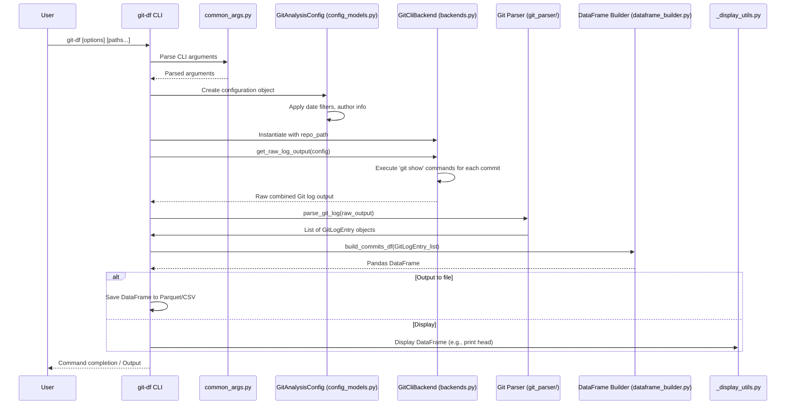
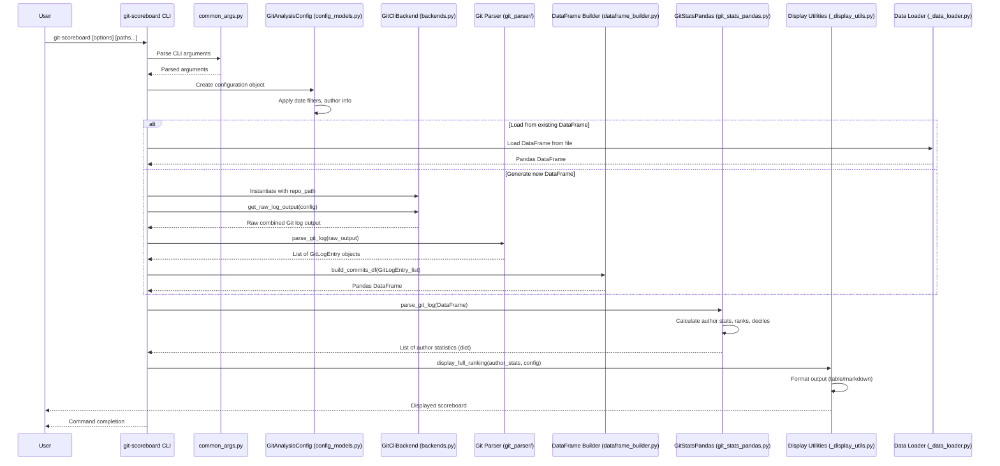

# Technical Walkthrough of `git-dataframe-tools`

This document provides a technical overview of the `git-dataframe-tools` codebase, detailing its major components and their interactions, particularly focusing on the command-line interface (CLI) driven workflows.

## 1. Core Components

The codebase is structured around several key modules responsible for different aspects of Git data processing and analysis:

*   **`src/git_dataframe_tools/cli/`**: Contains the CLI entry points and related utilities.
    *   `git_df.py`: The main CLI program for generating a Git DataFrame.
    *   `scoreboard.py`: The CLI program for generating a Git author scoreboard.
    *   `common_args.py`: Defines common command-line arguments shared across CLI tools.
    *   `_display_utils.py`: Handles formatting and displaying output (e.g., tables, markdown).
    *   `_data_loader.py`: Manages loading and validating existing DataFrames.
*   **`src/git_dataframe_tools/config_models.py`**: Defines the `GitAnalysisConfig` dataclass, which encapsulates all configuration parameters for a Git analysis (e.g., date ranges, author filters, paths).
*   **`src/git_dataframe_tools/git_repo_info_provider.py`**: An abstract base class (`GitRepoInfoProvider`) defining an interface for retrieving Git repository information (e.g., current user, repository validity).
*   **`src/git_dataframe_tools/git_python_repo_info_provider.py`**: An implementation of `GitRepoInfoProvider` using the `GitPython` library.
*   **`src/git_dataframe_tools/git_stats_pandas.py`**: Contains the core logic for processing Git DataFrames using Pandas, primarily for calculating author statistics, ranks, and deciles.
*   **`src/git2df/`**: This package is responsible for the core functionality of converting Git log output into a structured DataFrame.
    *   `backends.py`: Implements `GitCliBackend`, which interacts with the underlying Git CLI to fetch raw log data.
    *   `dulwich/`: A subpackage containing components for a Dulwich-based backend (e.g., `repo_handler.py`, `commit_walker.py`, `diff_parser.py`).
    *   `git_parser/`: Handles the parsing of raw Git log output.
        *   `_commit_metadata_parser.py`: Parses individual commit metadata lines.
        *   `_file_stat_parser.py`: Parses file change statistics (additions, deletions, change type).
        *   `_chunk_processor.py`: Processes raw chunks of Git log output, combining metadata and file changes into `GitLogEntry` objects.
    *   `dataframe_builder.py`: Takes a list of `GitLogEntry` objects and constructs a Pandas DataFrame.

## 2. Major Code Flows (CLI-driven)

The primary interactions with the codebase are initiated via the command-line tools `git-df` and `git-scoreboard`. Both follow a similar high-level pattern:

### 2.1. General CLI Workflow

The general flow for any CLI command involves argument parsing, configuration setup, backend selection, data acquisition, and eventual processing/display.

### 2.2. `git-df` Command Workflow

The `git-df` command focuses on extracting Git commit and file change data and presenting it as a Pandas DataFrame, which can then be saved or displayed.

### 2.3. `git-scoreboard` Command Workflow

The `git-scoreboard` command leverages the Git DataFrame to calculate and display author-centric statistics, including contributions, ranks, and deciles.

